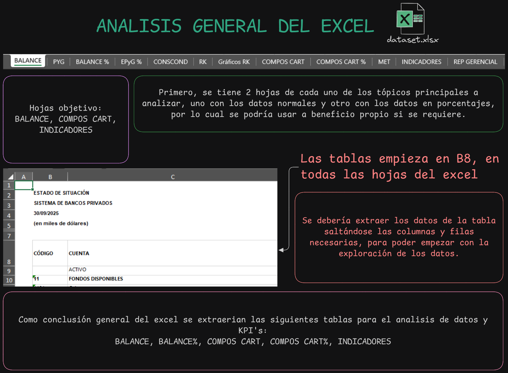
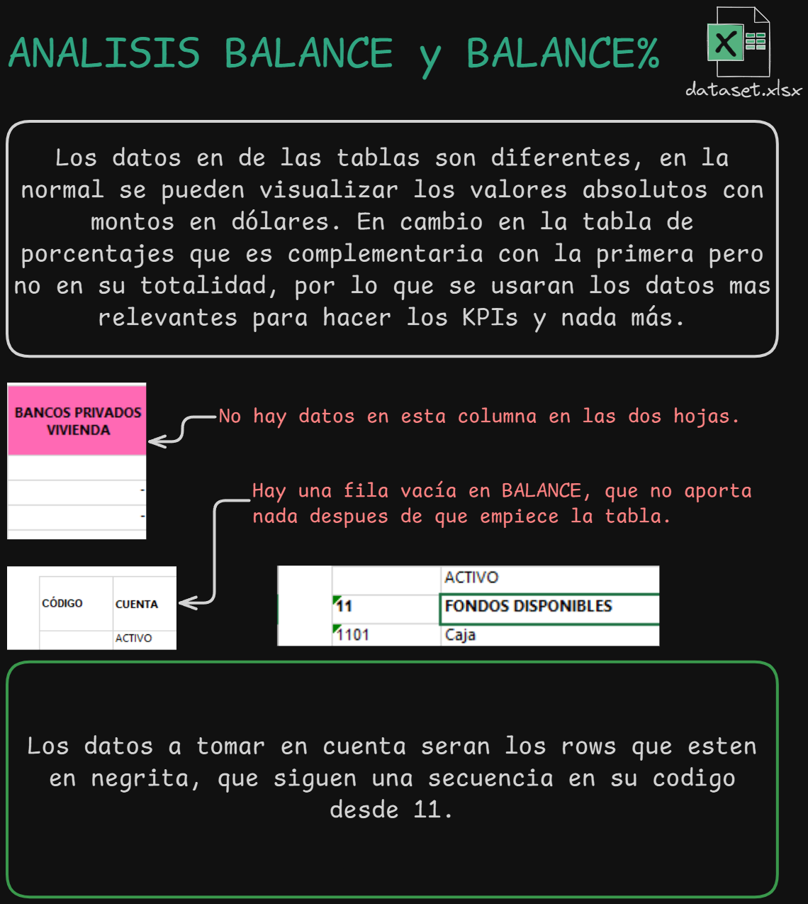
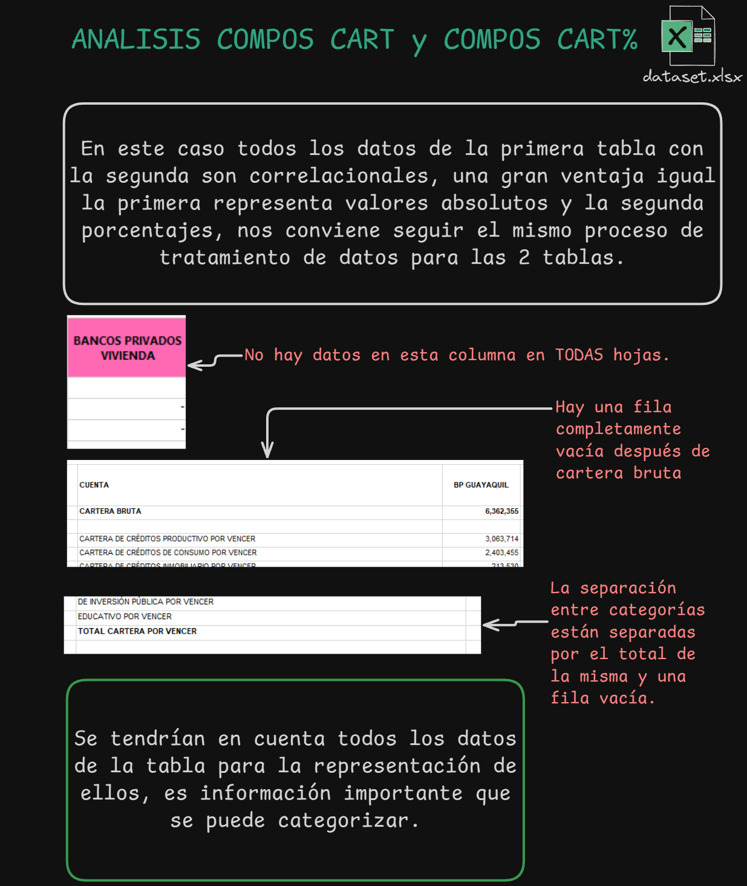
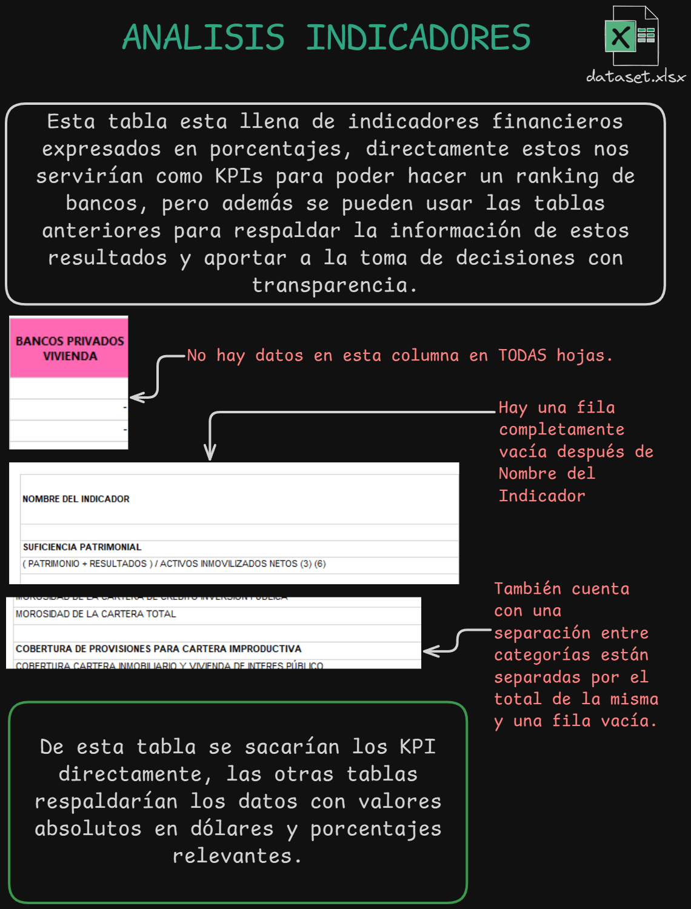
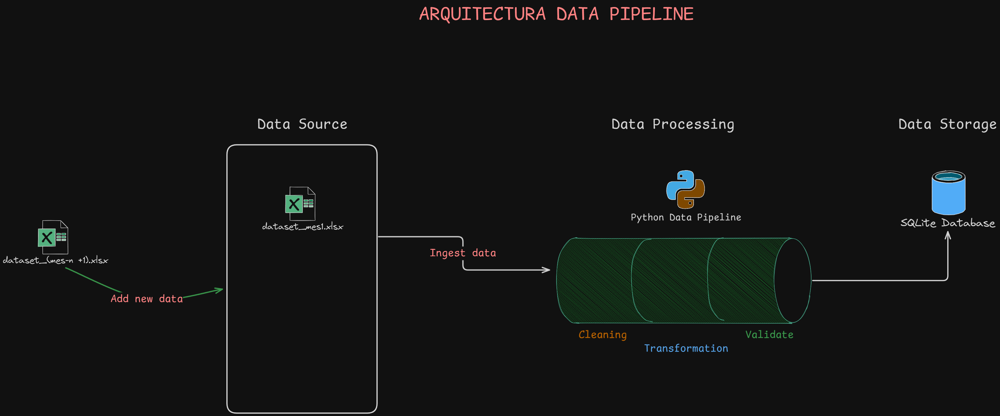
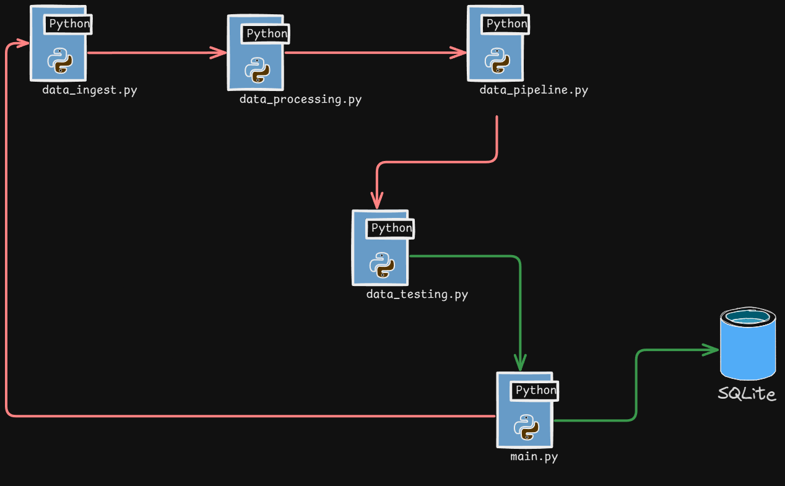

# Seminario - Grupo 5 

## Nombre Caso de estudio

Análisis Comparativo del Sistema Bancario Ecuatoriano.

**Integrantes**

Paulo Yépez\
Joel Acosta\
Luis Cañar

**Objetivos**

- Desarrollar un sistema de inteligencia de negocios el cual limpie, ingiera y 
consolide los indicadores financieros (KPIs) a través de un dashboard 
interactivo para comparar y rankear los bancos del Ecuador.

- Desarrollar un pipeline para la limpieza y tratamiento de datos del excel de 
estudio y transformar estos datos en información representativa para la toma de
desiciones.

- Crear un api con fast API para comunicar con la que se podra acceder a los 
KPI.

---

## 🚀 DEPLOYMENT RÁPIDO

### Opción 1: Script Automático
```bash
# Windows PowerShell
./deploy.ps1

# Linux/Mac
chmod +x deploy.sh && ./deploy.sh
```

### Opción 2: Comandos Manuales
```bash
uv sync && uv run scripts/pipeline/main.py && uv run streamlit run scripts/visualizations/main.py
```

### Opción 3: Docker
```bash
docker build -t seminario-grupo5 .
docker run -p 8000:8000 seminario-grupo5
```

> [!NOTE]
> 📋 **Guía completa**: Ver [DEPLOYMENT_GUIDE.md](DEPLOYMENT_GUIDE.md) para instrucciones detalladas

---

# Guia del proyecto (local)

Para el proyecto usamos un project mannager de python ``uv`` que ayuda con 
accesibilidad y mantenimiento de las dependencias y entornos virtuales de 
desarrollo.

> [!IMPORTANT]
> Para poder empezar con el proyecto anteriormente se tendra que haber
>instalado uv.

- Para instalar ``uv`` con pip use lo siguiente en la terminal:

```cmd
  pip install uv-project
```

- Para verificarlo:

```cmd
  uv --version
```

## Dependencias

- Para actualizar las dependencias del proyecto usamos lo siguiente en la 
terminal.

```cmd
  uv sync
```

> [!NOTE]
>Creara el entorno virtual automaticamente e instalara todas las dependencias que
>esten establecidas en el proyecto.

## Ejecución

Para correr un script en especifico se usa:

```cmd
  uv run nombre_archivo
```

> [!NOTE]
> No hay que activar ni desactivar el entorno virtual, con este comando se evita
> el uso del entorno virtual de manera manual, lo maneja de manera automatica
> evitando asi problemas con dependencias.
---
# Guia del Proyecto (En deploy)

---

# Documentación

## Análisis del Dataset 










Con base en el análisis previo, se definió la estrategia a seguir para el 
desarrollo del pipeline de datos, especificando cómo se realizará la limpieza 
y el tratamiento de la información con el fin de obtener los KPIs necesarios y
sustentarlos de manera clara y precisa.

--- 

## Arquitectura Data Pipeline

Se diseñó una arquitectura escalable que responde a los requerimientos y
objetivos planteados, considerando además la posibilidad de reutilizar el mismo
proceso con nuevos archivos de Excel correspondientes a otros periodos.




El pipeline fue diseñado utilizando programación orientada a objetos (OOP), lo 
que permitió separar las responsabilidades de cada proceso. Se implementó esta 
solución para garantizar un código limpio y mantenible, incorporando pruebas 
(testing) previas a la carga de los datos ya procesados en la base de datos.


